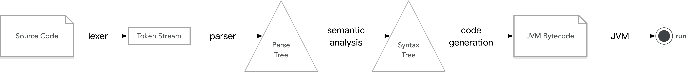
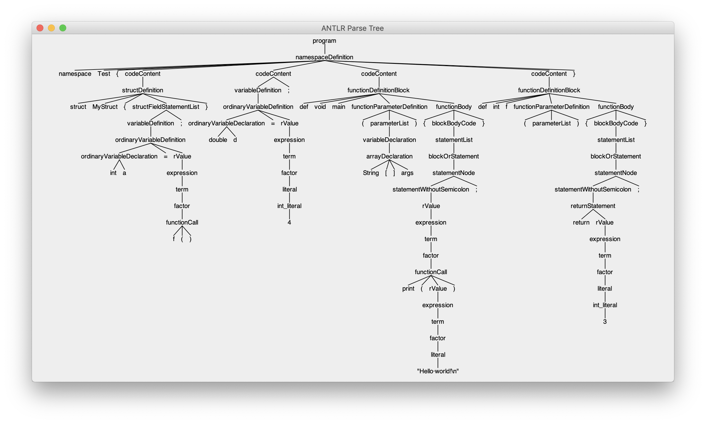
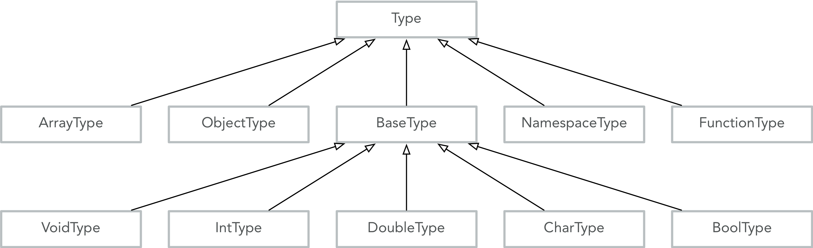
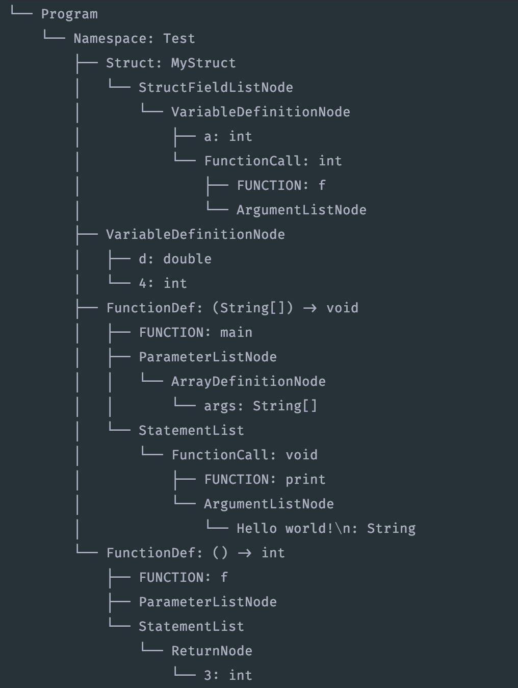
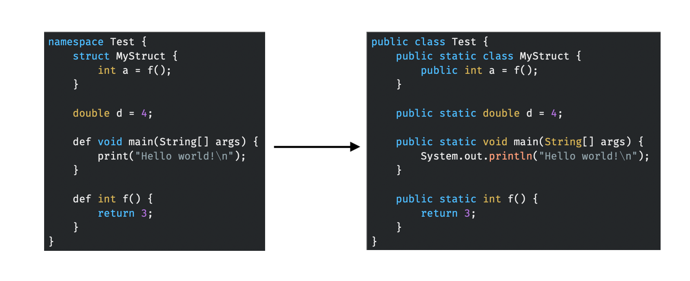
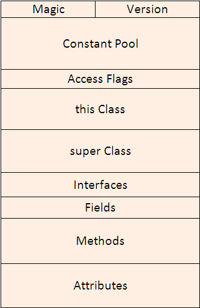
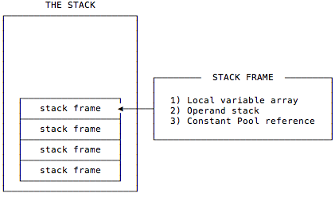

# JC Compiler

## 概述

本编译器的语言是一门自定义的语言，具有面向过程特性，语言特点取自 Java 和 C 的交集（因此简称为 JC Compiler）。

本编译器使用 Java 编写，将源代码编译为 JVM Bytecode，并生成 `.class` 文件。该文件可以在 JVM（Java Virtual Machine）下运行。

## 第三方库

* org.antlr:antlr4:4.7.2 （用于进行词法分析和语法分析）
* org.ow2.asm:asm:7.1 （用于辅助生成 JVM Bytecode）
* commons-cli:commons-cli:1.4 （用于解析命令行指令）

## 运行环境以及方法

### 运行环境：

* Java 8
* Gradle 5.2

### 编译/运行方法：

### Build

```
gradle build
```

### Run

```
java -jar <JAR_name> <file_name> [options]
```

options：

`-p` , `—parsetree` : 同时生成 parse tree 。

`-s` , `-syntaxtree`：同时生成 syntax tree 。

## 语言特性示例

```c++
namespace Test {
    struct MyStruct {
        int a = f();
    }

    double d = 4;

    def void main(String[] args) {
        print("Hello world!\n");
    }

    def int f() {
        return 3;
    }
}
```

## 基本语言特点支持

* 命名空间 `namespace`
* 结构体 `struct`
* 函数
* 类型的支持：`int` 、 `double` 、 `char` 、 `String` 、 数组类型和 `struct` 类型
* `if` 、`elif` 、`else` 结构
* `for` ，`while` 块以及 `break` ，`continue` 语句

## 编译器架构



## 代码实现

### 词法/语法分析

本程序的词法分析使用第三方库 ANTLR，事实上，在 ANTLR 中词法分析和语法分析被合并到一起（虽然源码层次上是分开的）。所有语法词法的描述文件在 `src/main/antlr/rules.g4` 文件中，内部格式类似于：

```
program:
	namespaceDefinition
	;
	
namespaceDefinition:
	NAMESPACE_SYMBOL IDENTIFIER LEFT_CURLY_BRACE codeContent+ RIGHT_CURLY_BRACE
	;

//...
```

格式与 `Flex/Bison` 类似，只不过词法规则和语法规则可以在一个文件里书写。需要注意的是，ANTLR 采用了 LL 的识别方式，因此需要手动处理左递归的情形。

对于给定规则和源代码，ANTLR 会生成一棵 parse tree，其节点是类型为 `ParserRuleContext` 的对象，通过对这个对象的操作，可以获得有关的信息。

#### Parse Tree

示例代码生成的 parse tree 如下：



### 语义分析

ANTLR 使用 Visitor 模式来提供对 parse tree 的访问，可以通过递归的方式遍历树同时生成语法树并加上属性。

通过继承  `XXXBaseVisitor<...>`  来实现访问 parse tree：

```java
class AstGenerator extends XXXBaseVisitor<AstGeneratorResult> {
    public AstGeneratorResult visitXXX(ParserRulesContext ctx) {
      //...
    }
  //...
}
```

#### 符号信息与引用

遍历树从根节点开始，逐渐向下，但不是严格的深度遍历，因为不是所有属性都可以通过深度遍历来得到。在遍历树的过程中，通过另一个  `XXXBaseVisitor<...>`  的子类 `SymbolTableGenerator` 来提前获得当前上下文的符号信息。由于本语言支持前向引用，所以 `SymbolTableGenerator` 必须把当前上下午的所有符号都扫描出来，接着才能进行接下来的分析树的遍历，相当于扫了两遍。

`SymbolTableGenerator` 的定义如下：

```java
public class SymbolTableGenerator extends rulesBaseVisitor<SymbolTableResult> {
    private ScopeHandler scopeHandler;
    private AstGenerator astGenerator;
    //...
}
```

它和 `AstGenerator` 一样都是 `rulesBaseVisitor` 的子类。它的成员变量 `scopeHandler` 存储了符号表相关的信息。

##### 符号表

###### ScopeHandler

`ScopeHandler` 是符号表信息的管理类，它 的定义如下：

```java
public class ScopeHandler {
    private Stack<Scope> scopeStack = new Stack<>();
    public void enterScope(...) {}
    public void existScope(...) {}
    //...
}
```

可以看见，符号表使用一个栈来进行管理，当需要查找符号时，从栈顶往下一直查找。当 `enterScope()` 方法被调用时，`Scope` 被压入栈；当 `existScope()` 被调用时，`Scope` 被推出栈。

###### Scope

`Scope` 存储了具体某一个上下文的符号信息，其定义如下：

```java
public class Scope {
    private Map<String, DefinitionNode> symbolTable = new HashMap<>();
    private Node correspondingNode;
    //...
}
```

可以看到，符号表时使用一个 `HashMap` 来存储的，它将名字映射到 syntax tree 对应的定义节点。每个 `Scope` 实例都有一个关联着一个 syntax tree 的节点，方便进行回溯查找。

##### 符号确定

在遍历命名空间定义、函数定义、结构体定义、代码块（如循环、逻辑判断）时，要在它们对应的 ast 的节点中保存其内部的符号表。

在遍历到名称的使用（如函数调用、结构体引用和变量引用）时，需要在它们对应的 ast 节点中存储指向对应定义节点的引用（即指针），这样在代码生成时就能知道变量到底指向的是谁。

在遍历到 `break` ，`continue` 语句时，也要在对应 ast 节点保存指向最内层循环块节点的指针，来说明这一语句到底控制的哪个循环的进行。

#### 类型信息

类型信息通过递归方式沿着 parse tree 向上传递，对于函数调用、表达式等使用这种方式就能在编译时刻获得类型信息。

##### 类型系统



每一个类型都映射到了最终 JVM 的一个类型。

其中 `CharType` 使用 `byte` 表示，但是 JVM 中存储空间和 `int` 一样。`bool` 类型在 JVM 中使用 `int` 类型对应，按照惯例 `true` 对应 $1$ ，`false` 对应 $2$ 。

`ObjectType` 和 `NamespaceType` 都对应于 JVM 中的 `Object` 类型。

##### 向上转型

本语言唯一支持的类型转换是由 `int` 向  `double` 的自动转换，在遍历 parse tree时，如果发现在函数调用、赋值、变量定义、数组初始化等位置出现两边类型不一致（即右值为 `int` 型，左值为 `double` 型），不会判断编译错误，而是将它留到代码生成的阶段再进行向上转型，这里将使用 JVM 的 `I2D` 指令进行转型。

##### AST 的节点

Syntax tree 的节点大致可分为两种，一种是存储实际信息的节点，如存储语句的节点、存储变量的节点；还有一种是指明结构的节点，比如指明循环结构、逻辑判断结构的节点，这些节点自身不带有信息，但是它作为子节点的组织者，用来标明新结构的出现。

Syntax tree 的节点都是 `Node` 类型的子类，`Node` 类型本身是不可实例化的抽象类。

```java
public abstract class Node {
    private List<Node> children = new LinkedList<>();
    //...
}
```

每个节点的所有子节点都存储在一个 `List<Node>` 结构中。`Node` 的子类还被划分成如 `DefinitionNode` ，`RefNode` 等子类。节点中主要存储的信息有类型信息（如果对应的是一个实体的话），值信息（如果是 literal 的话），引用信息（如果是一个名字引用的话）等。

##### Syntax Tree

前面示例所产生的 syntax tree 的图示如下（是一棵横着打印的树）：



可以看到，类型属性被添加到 syntax tree 上了。

### 代码生成

本编译器将源代码最终转换为 JVM Bytecode，即一个 `Byte[]` 数组，并将这个数组写入文件，该文件可由 JVM 运行。代码生成部分使用 Java ASM 第三方库辅助生成。

Java ASM 提供了 `ClassVisitor` 、`MethodVisitor` 等接口，使我们能方便地生成 JVM 汇编代码。

本语言中有关数据结构映射关系如下：

| 本语言的结构             | JVM 对应的结构                                    |
| ------------------------ | ------------------------------------------------- |
| `Namespace`              | `class`                                           |
| `Struct`                 | 所在 `Namespace` 的内部类（public，static）       |
| `Struct` 中的成员变量    | 所在 `Struct` 的普通成员变量（public）            |
| `Namespace` 中声明的变量 | 所在 `Namespace` 的静态成员变量（public，static） |
| 函数                     | 所在 `Namespace` 的静态方法（public，static）     |
| 其他                     | 与 JVM 中完全一致                                 |

与前面的示例等价的 Java 如下，以下左右两边代码等价（右侧代码仅作示例，不会真正生成这样的 Java 代码）：



#### 中间代码格式

本编译器中间代码即为 JVM Bytecode，具体可参照 [JVM Instruction Set](https://docs.oracle.com/javase/specs/jvms/se7/html/jvms-6.html) ，简单叙述如下：

JVM 的 `.class` 文件的格式如下图所示：



其中 Constant Pool 存储程序中出现的字面量，类、成员变量和方法的名字和其他一些常量的值。

Access Flags 指的是访问作用符，对于本语言的 `Namespace` 来说是 `ACC_PUBLIC` 和 `ACC_SUPER` 。

super Class 指明父类，由于本语言不支持继承，因此父类为 `java.lang.Object` 。

本语言对应的 class 文件 Interfaces 为空。

Fields 部分将会填充定义在 `Namespace` 结构中的变量，它们都是 `static ` 的。

Methods 部分会填充 `Namespace` 结构中的各个函数，它们也都是 `static` 的；每个方法具体的汇编指令会被填充到这里。

Attributes 部分由 ASM 第三方库代为自动填充，一般会有内部类的一些信息（在本语言中是 `Struct` ）。

#### JVM 运行方式

JVM 本质上是一个堆栈机，所以对应的汇编代码（中间代码）也适应了这一情况。



JVM 中每一个线程对应一个 stack，stack中每一层是一个 frame。每个frame中分别有一个存储局部变量的数组（因此在方法中，局部变量的名字被隐去，只剩下编号），一个 operand stack（用于指令进行操作）。每条指令都会从顶到底地使用合适数量的变量，将它们弹出，操作后假如需要再放回顶端。

#### JVM 汇编代码的生成

需要注意的有：对于每一个方法，都必须有一个返回值，否则 JVM 对 class 文件的校验阶段将无法通过。

一下分析仅仅以几条指令作为例子：

##### 加法指令

对于不同的对象有不同的加法指令（如 `double` 对应的是 `DADD` ，`int` 对应的是 `IADD` ）。加法指令将 operand stack 顶端的两个元素弹出，做加法操作后重新压入。这里，如果两个运算数的类型不一致（一个是 `double` 而另一个是 `int` ），那么需要使用 `I2D` 指令将 operand stack 顶端的元素从 `int` 转变为 `double` 型。

加法指令的伪代码如下：

```assembly
//push the first operand
//push the second operand
IADD
```

可以看到，压入操作数的操作可以递归地完成。如操作数由一个函数产生，那么先使用调用函数的指令，这条指令会把函数的返回结果压入 operand stack，这样以来就可以被接下来的 `IADD` 指令所利用。

##### 调用函数

由于本语言所有的函数翻译到 JVM  上后都是属于类的静态函数，所以调用函数会使用指令 `invokestatic` 。

其伪代码如下：

```assembly
invokestatic <XXX> # 这里 <XXX> 是对 constant pool 的一个引用编号，引用的是一个方法信息
```

##### for 循环块

```java
for (initStatements; condition; stepStatements) {
    //BlockCode
}
```

对于如上所示的 for 循环，可以翻译为以下的 JVM 汇编代码：

```assembly
   //do initStatements
loop_label:
    //push condition
    ifeq end_label
    //BlockCode
continue_label:    
    //stepStatements
    goto loop_label
end_label:
    ...
```

这里 `continue_label` 是用在 `continue` 语句中的。

`if_eq` 指令从 operand stack 顶端取出一个操作数，将它与 $0$ 比较。如果它等于零，就将 PC（program counter） 跳转到 `end_label` 对应位置。

##### if-elif-else 块

```python
if (C1) {
    B1
} elif (C21) {
    B21
} else {
    B3
}
```

对于如上的 `if-elif-else` 语句块可以翻译为以下汇编代码：

```assembly
    //push C1
    ifeq else_label1
    B1
    goto end_label
else_label1:
    //push C21
    ifeq else_label2
    B21
    goto end_label
else_label2:
    //else part
    B3
end_label:
    ...
```

## 代码优化

本项目的主要优化发生在代码生成阶段。对于同一语义，JVM 提供了多条指令，本编译器在选择指令时进行了优化。

例如，如果想将一个 `reference` 型的局部变量 `load` 到 operand stack 中，如果局部变量的索引小于 4 ，那么有两种选择：

```
aload <index>
aload_X # 这里 X 可以是 0，1，2，3
```

在此编译器中，如果发现局部变量的索引小于 4，那么它将选择后一种指令，如果不满足才会选择前一条指令。

