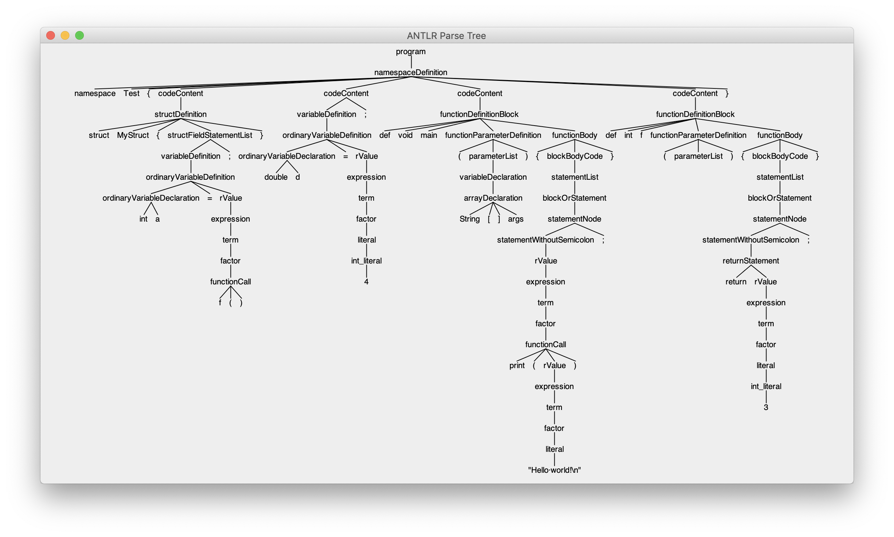

# JC Compiler

## 分工

陈佳伟：词法分析，语法分析（部分），代码生成（部分），测试

戚浙拓：语法分析（部分），代码生成（部分），代码优化

## 概述

本编译器的语言是一门自定义的语言，具有面向过程特性，语言特点取自 Java 和 C 的交集（因此简称为 JC Compiler）。

本编译器使用 Java 编写，将源代码编译为 JVM Bytecode，并生成 `.class` 文件。该文件可以在 JVM 下运行。

## 第三方库

* org.antlr:antlr4:4.7.2 （用于进行词法分析和语法分析）
* org.ow2.asm:asm:7.1 （用于辅助生成 JVM Bytecode）
* commons-cli:commons-cli:1.4 （用于解析命令行指令）

## 运行环境以及方法

### 运行环境：

* Java 8
* Gradle

### 运行方法：

Build:

```
gradle build
```

Run:

```

```


## 语言特性展示

```c++
namespace Test {
    struct MyStruct {
        int a = f();
    }

    double d = 4;

    def void main(String[] args) {
        print("Hello world!\n");
    }

    def int f() {
        return 3;
    }
}
```

## 基本语言特点支持

* 命名空间 `namespace`
* 结构体 `struct`
* 函数
* 类型的支持：`int` 、 `double` 、 `char` 、 `String` 、 数组类型和 `struct` 类型
* `if` 、`elif` 、`else` 结构
* `for` ，`while` 块以及 `break` ，`continue` 语句

## 编译器架构


## 代码实现

### 词法/语法分析

本程序的词法分析使用第三方库 ANTLR，事实上，在 ANTLR 中词法分析和语法分析被合并到一起（虽然源码层次上是分开的）。所有语法词法的描述文件在 `src/main/antlr/rules.g4` 文件中，内部格式类似于：

```
program:
	namespaceDefinition
	;
	
namespaceDefinition:
	NAMESPACE_SYMBOL IDENTIFIER LEFT_CURLY_BRACE codeContent+ RIGHT_CURLY_BRACE
	;

//...
```

格式与 `Flex/Bison` 类似，只不过词法规则和语法规则可以在一个文件里书写。需要注意的是，ANTLR 采用了 LL 的识别方式，因此需要手动处理左递归的情形。

对于给定规则和源代码，ANTLR 会生成一棵 parse tree，其节点是类型为 `ParserRuleContext` 的对象，通过对这个对象的操作，可以获得有关的信息。比如，示例代码生成的 parse tree 如下：



### 语义分析

ANTLR 使用 Visitor 模式来提供对 parse tree 的访问，可以通过递归的方式遍历树同时生成语法树并加上属性。

通过继承  `XXXBaseVisitor<...>`  来实现访问 parse tree：

``` java
class AstGenerator extends XXXBaseVisitor<AstGeneratorResult> {
    public AstGeneratorResult visitXXX(ParserRulesContext ctx) {
      //...
    }
  //...
}
```

#### 符号信息与引用

遍历树从根节点开始，逐渐向下，但不是严格的深度遍历，因为不是所有属性都可以通过深度遍历来得到。在遍历树的过程中，通过另一个  `XXXBaseVisitor<...>`  的子类 `SymbolTableGenerator` 来提前获得当前上下文的符号信息。

在遍历命名空间定义、函数定义、结构体定义、代码块（如循环、逻辑判断）时，要在它们对应的 ast 的节点中保存其内部的符号表。

在遍历到名称的使用（如函数调用、结构体引用和变量引用）时，需要在它们对应的 ast 节点中存储指向对应定义节点的引用（即指针），这样在代码生成时就能知道变量到底指向的是谁。

在遍历到 `break` ，`continue` 语句时，也要在对应 ast 节点保存指向最内层循环块节点的指针，来说明这一语句到底控制的哪个循环的进行。

#### 类型信息

类型信息通过递归方式沿着 parse tree 向上传递，对于函数调用、表达式等使用这种方式就能在编译时刻获得类型信息。

##### 类型系统


##### 向上转型

本语言唯一支持的类型转换是由 `int` 向  `double` 的自动转换，在遍历 parse tree时，如果发现在函数调用、赋值、变量定义、数组初始化等位置出现两边类型不一致（即右值为 `int` 型，左值为 `double` 型），不会判断编译错误，而是将它留到代码生成的阶段再进行向上转型，这里将使用 JVM 的 `I2D` 指令进行转型。

